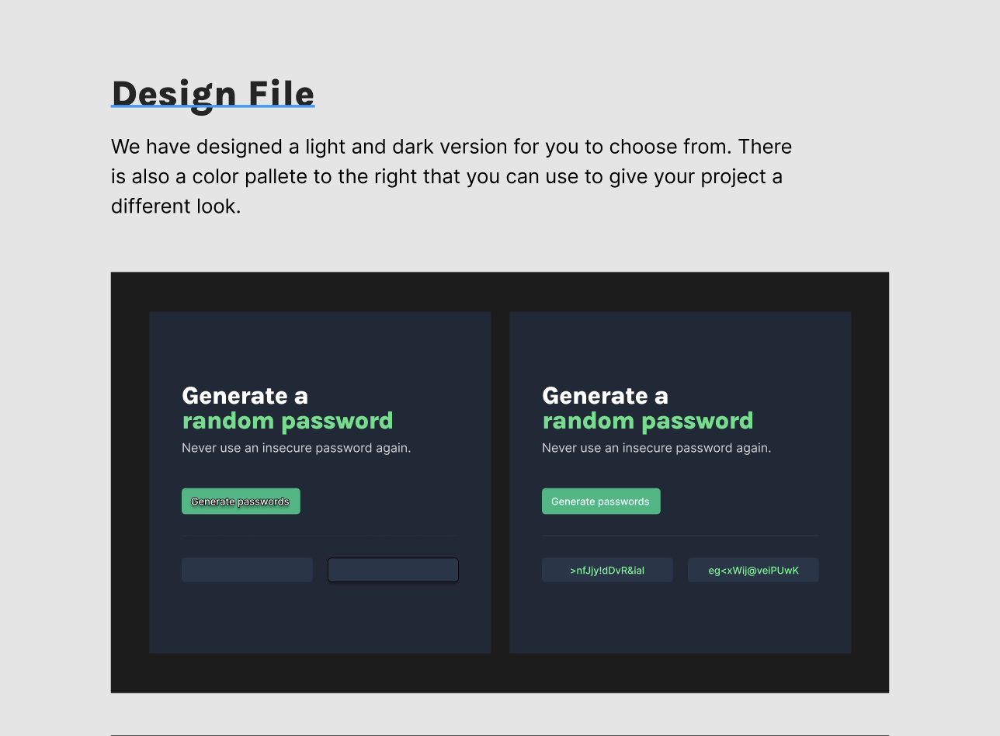

# 🔐 Random Password Generator

A modern password generator built with HTML, CSS, and JavaScript.

Generate secure random passwords instantly with a clean and responsive user interface. This project was originally inspired by a Figma design and later customized with improved styling, interactive features, and a modern developer-focused aesthetic.

## 🌐 Live Demo

[Visit the Website](https://generatespasswords.netlify.app)

---

## 📸 Preview



---

## ✨ Features

- Generate random secure passwords
- Generate two passwords at once
- Copy passwords with a single click
- Responsive card-based layout
- Modern dark theme UI
- Clean typography and improved visual hierarchy
- Fast and lightweight
- Runs entirely in the browser

---

## 🛠️ Built With

- HTML5
- CSS3
- JavaScript (Vanilla JS)

---

## 🚀 How It Works

1. Click **Generate Passwords**
2. Two random passwords are generated
3. Click any password to copy it
4. Paste it wherever you need a secure password

All passwords are generated locally in your browser.

---

## 📂 Project Structure

```text
.
├── index.html
├── index.css
├── index.js
└── README.md
```

---

## 🧠 What I Learned

This project helped me practice:

- DOM Manipulation
- Event Handling
- JavaScript Functions
- Arrays and Loops
- Random Number Generation
- CSS Flexbox
- UI Design Principles
- Working from a Figma Design

---

## 🔒 Password Generation Logic

Passwords are generated by:

1. Creating a collection of letters, numbers, and special characters.
2. Randomly selecting characters from the collection.
3. Combining them into a password of a specified length.
4. Displaying the generated password on the page.

Example:

```js
function generatePassword() {
    let password = ""

    for(let i = 0; i < lengthOfPassword; i++) {
        let randomNumber =
            Math.floor(Math.random() * characters.length)

        password += characters[randomNumber]
    }

    return password
}
```

---

## 🎯 Future Improvements 

- Password length slider
- Password strength indicator
- Include/exclude symbols
- Include/exclude numbers
- Light/Dark theme toggle
- Password history
- Copy success notifications

---

## 💡 Inspiration

The initial layout was inspired by a Figma design challenge and later redesigned with custom styling and additional improvements.

---

## 👨‍💻 Author

Built by **Sharath Prathapagiri**

GitHub: https://github.com/Sharath8599

---

## 📜 License

This project is open source and available under the MIT License.